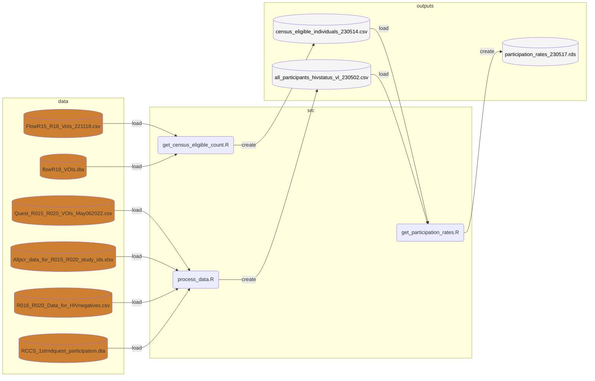
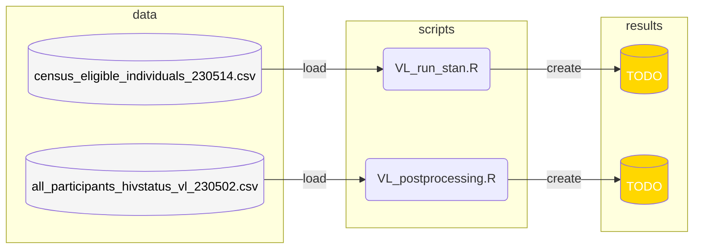

# Data Preprocessing

The flowchart below illustrates in detail how the data is consumed and processed by various R scripts at each stage. The coloured silos, rounded boxes, and grey boxes, represent data, R scripts, and directories respectively. The data is coloured according to the [medallion architecture](https://www.databricks.com/glossary/medallion-architecture), where bronze represents raw data, silver represents cleansed and processed data, and gold represents data which are consumption ready (i.e. directly used within statistical models).

Successively, the outputs of the preprocessing are used in order to run our models.
(To finish)

